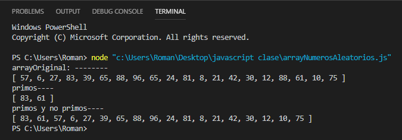

# Aprende un lenguaje de programación en un día (ejercicio voluntario para subir nota).

## Introducción

Cuando te sacaste el carnet de conducir, aprendiste las normas de circulación así como los fundamentos básicos para manejar un coche: volante, marchas, freno, acelerador, embrague, retrovisores... Seguramente, el coche que conduces ahora es diferente al que utilizaste para aprender a conducir, no obstante, lo puedes llevar sin problema. Cada coche tiene sus peculiaridades, pero quien sabe manejar un automóvil, puede adaptarse a las medidas, tacto y comportamiento de un vehículo en cuestión de horas.

Aprender a programar es como aprender a conducir. Si tienes una base sólida de programación y sabes manejar con soltura los tipos de datos, bucles, arrays, clases, métodos, etc. podrás pasar de un lenguaje a otro en un período relativamente corto, simplemente tendrás que adaptarte a la sintaxis y a las peculiaridades del nuevo lenguaje.

Con este ejercicio se pretende despertar el interés por otros lenguajes de programación distintos al que el alumno está estudiando como primer lenguaje.

Sigue los pasos que se indican a continuación.

## Creación del equipo

Este ejercicio se debe hacer en grupos de 3 alumnos. Uno de ellos será el representante del grupo.

## Forkea forkea

El representante del grupo debe hacer un *fork* de este repositorio para utilizarlo como base.

## Añadiendo colaboradores

El encargado del grupo deberá añadir como colaboradores del repositorio *forkeado* a los otros dos miembros, para trabajar todos sobre los mismos archivos. Cuando alguien es colaborador en un repositorio, puede hacer *push* a él sin necesidad de pedir permiso o hacer *pull request*.

Para añadir colaboradores hay que hacer click en la pestaña *Settings* y seleccionar luego *Collaborators* en el menú.

## Miembros del grupo

Escribe aquí los miembros del grupo. El primero es el representante o encargado.

* Román Pastushenko
* Alvaro Lopez
* Daniel Campaña

## Lenguaje de programación

El profesor llevará una cajita llena de papelitos con los nombres de distintos lenguajes de programación. Los encargados de cada grupo meterán la mano en la caja y sacarán dos papelitos, de los cuales el grupo elegirá uno. No se permite hacer intercambio de papelitos entre grupos.

Escribe el lenguaje de programación elegido por el grupo.

* Javascript

Los papelitos se han recortado de este [documento](lenguajes_de_programacion.pdf).

## Información sobre el lenguaje

Busca páginas y/o manuales sobre el lenguaje de programación elegido. Escribe aquí las principales características: cuándo y para qué se creó, en qué ámbito se utiliza, cuáles son sus principales ventajas, etc. Pon aquí enlaces y capturas de pantalla.
¿Qué es Javascript?
Javascript es un lenguaje con muchas posibilidades, utilizado para crear pequeños programas que luego son insertados en una página web y en programas más grandes, orientados a objetos mucho más complejos. Con Javascript podemos crear diferentes efectos e interactuar con nuestros usuarios.

Este lenguaje posee varias características, entre ellas podemos mencionar que es un lenguaje basado en acciones que posee menos restricciones. Además, es un lenguaje que utiliza Windows y sistemas X-Windows, gran parte de la programación en este lenguaje está centrada en describir objetos, escribir funciones que respondan a movimientos del mouse, aperturas, utilización de teclas, cargas de páginas entre otros.
Javascript tiene la ventaja de ser incorporado en cualquier página web, puede ser ejecutado sin la necesidad de instalar otro programa para ser visualizado.

Ventajas :
1 Es un lenguaje muy sencillo.
2 Es rápido, por lo tanto tiende a ejecutar las funciones inmediatamente.
3 Cuenta con múltiples opciones de efectos visuales.
4 Es soportado por los navegadores más populares y es compatible con los dispositivos más modernos, incluyendo iPhone, móviles y PS3.
5 Es muy versátil, puesto que es muy útil para desarrollar páginas dinámicas y aplicaciones web.
6 Es una buena solución para poner en práctica la validación de datos en un formulario.
7 Es multiplataforma, puede ser ejecutado de manera híbrida en cualquier sistema operativo móvil.

Desventajas:
1 Tiende a introducir gran cantidad de fragmentos de código en los sitios web.
2 Sus opciones 3D son limitadas, si se quiere utilizar este lenguaje de programación para crear un juego, deben emplearse otras herramientas.
3 No es compatible en todos los navegadores de manera uniforme.
4 Los usuarios tienen la opción de desactivar JavaScript desde su navegador.
5 Sus script son limitados por razones de seguridad y no es posible realizar todo con JavaScript, por lo tanto es necesario     complementarlo con otros lenguajes evolucionados y más seguros. Esta es una de las características de JavaScript que algunos expertos lo contemplan como una ventaja y otros como una desventaja.


## Herramientas de desarrollo

1- Lo primero que debemos hacer es descargar e instalar Node.js.
Link de descarga: https://nodejs.org/es/download/

2-Utilizaremos Visual Studio Code, en caso de no tenerlo debemos descargarlo e instalarlo en nuestro equipo.
Link de descarga: https://code.visualstudio.com/download

3- Instalamos "Coderunner" desde Visual Studio Code que nos servirá para ejecutar los programas en consola.
## Poniendo en práctica el lenguaje

Pon en práctica el lenguaje de programación realizando los siguientes ejercicios. Para cada uno de los ejercicios, pega el código fuente de la solución y una captura de pantalla.

### 1. ¡Hola mundo!
Realiza un programa que muestre por pantalla la frase **¡Hola mundo!**.
```javascript
console.log("hola mundo");
```


### 2. Pirámide
Dada una altura introducida por el usuario, realiza un programa que pinte una pirámide a base de asteriscos con la altura indicada.
```javascript
var numFilas = prompt("Numero de filas");

for(let altura = 1; altura<=numFilas; altura++){
    //Espacios en blanco
    for(let blancos = 1; blancos<=numFilas-altura; blancos++){
        process.stdout.write(" ");
    }
     
    //Asteriscos
    for(let asteriscos=1; asteriscos<=(altura*2)-1; asteriscos++){
        process.stdout.write("*");
    }
    console.log();
} 
```


### 3. Arrays y números aleatorios

Realiza un programa que rellene un array (o una estructura similar) con 20 números enteros aleatorios entre 1 y 100 y que seguidamente los muestre por pantalla. A continuación, se deben pasar los números primos a las primeras posiciones del array y los no primos a las posiciones restantes. Muestra finalmente el array resultado.

```javascript
var arrayNumeros = [];
for (let i = 0; i < 20; i++) {
    var numeroAleatorio = Math.floor(Math.random() * 100) + 1;
    arrayNumeros.push(numeroAleatorio);
}
var primos = [];
for (let i = 0; i < arrayNumeros.length; i++) {
    var contador = 0;
    for (let j = 1; j <= arrayNumeros[i]; j++) {
        if (arrayNumeros[i] % j == 0) {
            contador++;
        }
    }
    if (contador == 2) {
        primos.push(arrayNumeros[i]);
    }
    contador = 0;
}
console.log("arrayOriginal: --------");
console.log(arrayNumeros);
console.log("primos----");
console.log(primos);
for (let i = 0; i < arrayNumeros.length; i++) {
    if (primos.includes(arrayNumeros[i]) == false) {
        primos.push(arrayNumeros[i]);
    }
}
console.log("primos y no primos----");
console.log(primos);
```





## Presentación de resultados

Cada equipo explicará al resto de la clase lo aprendido durante la realización del ejercicio. Todos los miembros de cada equipo deben participar en la explicación. Se puede utilizar como material de base para la presentación el repositorio de GitHub.

## Recompensa

* Todos los alumnos que realicen correctamente la actividad tendrán 0'25 puntos extra en la nota del trimestre.

* Los miembros del equipo más votado ganarán un premio.

:star: Si te ha gustado este ejercicio, dale una estrellita al [repositorio original](https://github.com/LuisJoseSanchez/aprende-un-lenguaje-en-un-dia).

